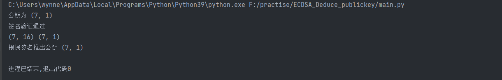

# Application of this deduce technique in Ethereum with ECDSA


# 一. ESDSA签名恢复的过程

### 产生密钥GenKey

- 选择一条椭圆曲线E_P(a,b)，选择基点G，G的阶数为n
- 选择随机数d ∈n为私钥，计算公钥Q = d⋅G

### 签名算法Sign

- 对消息m使用消息摘要算法，得到z=hash(m)
- 生成随机数k∈n，计算点(x, y)=k⋅G
- 取r=x mod n，若r=0则重新选择随机数k
- 计算s = k^−1(z+rd) mod n，若s=0则重新选择随机数k
- 上述(r,s)即为ECDSA签名

### 验证算法Verify

使用公钥Q和消息m，对签名(r,s)进行验证。

- 验证r,s∈n
- 计算z = hash(m)
- 计算u_1 =zs^−1 mod n和u_2 = rs^−1 mod n
- 计算(x, y) = u1⋅G+u2⋅Q mod n
- 判断r == x，若相等则签名验证成功

### 恢复算法Recover

已知消息m和签名(r,s)，恢复计算出公钥Q。

- 验证r, s∈n
- 计算R=(x, y)，其中x=r,r+n,r+2n…，代入椭圆曲线方程计算获得R
- 计算z = hash(m)
- 计算u_1 = −zr^−1 mod n和u_2 = sr^−1 mod n
- 计算公钥Q= (x’, y’)=u_1⋅G+u_2⋅R

### 对应代码：

```python
def deduce_pubkey(s, r, k, G):
    ele1=multi_inverse((s+r),17)

    ele2=Multi(k,G)

    ele3=Multi(s,G)
    ele4=(ele3[0],(-ele3[1])%17)
    print(ele2,ele4)

    result=Point_Add(ele2,ele4)

    print("根据签名推出公钥",result)
```

## 以太网公钥恢复的意义

​    在区块链系统中，客户端对每笔交易进行签名，节点对交易签名进行验证。如果采用「验证算法Verify」，那节点必须首先知道签发该交易所对应的公钥，因此需要在每笔交易中携带公钥，这需要消耗很大带宽和存储。如果采用「恢复算法Recover」，并且在生成的签名中携带recoveryID，就可以快速恢复出签发该交易对应的公钥，根据公钥计算出用户地址，然后在用户地址空间执行相应操作。

​	这里潜藏了一个区块链设计哲学，区块链上的资源（资产、合约）都是归属某个用户的，如果能够构造出符合该用户地址的签名，等同于掌握了该用户的私钥，因此节点无需事先确定用户公钥，仅从签名恢复出公钥，进而计算出用户地址，就可以执行这个用户地址空间的相应操作。


## 运行结果

