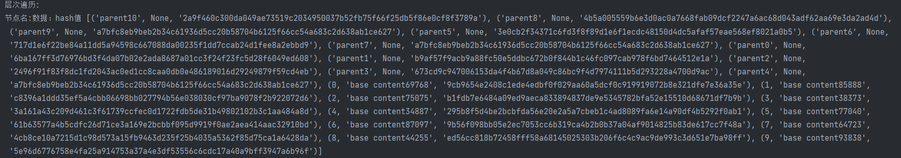

# Merkle Tree

图片显示不全，可以查看pdf

## 1.具体的项目代码说明

首先建立一个Merkel tree ，基于Merkel tree 的基本原则 构建一颗Merkel tree。

构建node类：节点的属性有左孩子右孩子 hash值 数据 父节点指针 两个标志位

```python
    def __init__(self, item):   #节点的内容
        self.item = item

        self.left = None
        self.right = None

        self.hash = None
        self.data = None

        self.parent=None   #指向父节点
        self.flag=0  #如果flag不是0那么就是叶子节点
        self.time=0
```


为了方便数据输入定义一个产生value的函数

```python
generate_value(i):
```


使用hashlib让hash值稳定。

```python
def Hash_single(string):
    s = hashlib.sha256()
    s.update(string.encode())
    b = s.hexdigest()
    return b
```


构建一个Merkel树类用于构建树，构建方法把两个节点进行hash然后把hash值赋值给父节点，若为奇数个节点

```python
def merkle(self,elelist):
```


用traversse函数来遍历输入所有的节点，输出顺序是层序遍历。

```python
def traverse(root_node):  # 层次遍历
```


用于把中间用于输入的第三方列表刷新

```py
def flesh(root_obj):
```


POP函数，用于返回一个节点的关键路径，关键路径用于重构根hash

```py
def POP(root_obj,id):  #返回关键路径
```


POA函数，不存在证明 用于返回这个节点的前一个节点和后一个节点的关键路径，用夹逼的方法来确定出来这个不存在

```python
def POA(root_obj,id):
```


重构Merkle树

```py
def reconstruct(Input,KeyPath):
```


对于同一层的非叶子节点的数目如果是奇数，那么把这个节点的hash直接给父节点。如果叶子节点存在奇数就把最后一个叶子节点复制一个然后构成偶数个叶子节点。


## 运行指导

直接运行即可。


## 代码运行过程截图

首先层次遍历一下所有的节点：（为了方便顺便把属性也打印出来，parent为父节点也就是非叶子节点 叶子节点用序号表示，因为是在插入前排序 所以这里相当于排序了，方便POA的时候使用）



下面的截图是Merkel tree重构的时候产生的父节点和hash 可以和上面的进行对比发现是一样的


这个是POP返回的关键路径用于重构hash


重构完毕如果发现重构出来的根hash 和本地保存的Merkel的根hash相同


下面返回的是不存在性证明的两个关键路径 同样的在进行两个重构也能检验，因为POA相当于两个POP那么这里就不重复了。


