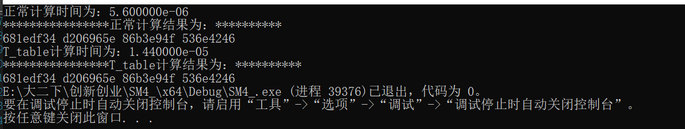
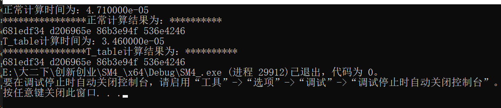
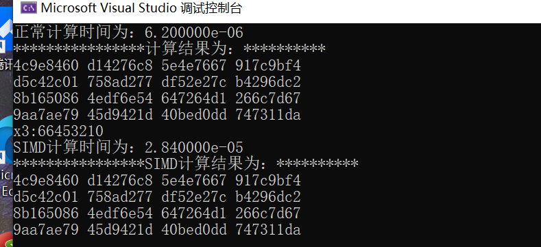

# SM4相关project
## SM4正常实现
按照SM4正常算法流程走下来的一套实现，在每一轮中主要采用T函数方法进行每一轮迭代  
* sm4_table中主要是各种表的具体数据  
* sm4_f中主要是定义的各项函数，包含T1 GetRK T encryptSM4 decryptSM4 encryptSM4_t_table encrypt_simd  
* sm4_.cpp中为具体时间测试等，其中测试数据为：  

	明文：	01234567 89abcdef fedcba98 76543210
	密钥：	01234567 89abcdef fedcba98 76543210
	密文：	681edf34 d206965e 86b3e94f 536e4246
## SM4_T_table实现
T_table可以通过设置一个flag位来直接生成该表，也可以通过直接复制粘贴，这里采用第二种方法在sm4_table中直接将表给出，其作用主要体现在每一轮迭代时不是采用T函数而是进行查表运算减少了异或、移位等运算从而加快了速度。  
	将32位中8位进行摘取的方式这里采用在移位后强制类型转化为8位从而得到索引直接进行查表运算即可  
	运行结果如下：  
    
	  
	第一张为单次加密，第二张为15次加密，可以看出在对单次加密时使用T_table后速度并没有加快，而在将该过程扩展到15次时这时T_table的作用显示了出来。而在日常对消息加密时消息长度一般很长当采用ECB模式进行加密时这个时候T_table可以明显加快速度。

## SM4用SIMD加速
这里采用128位4个32寄存器的模式来进行同时对四组明文进行加密的时间测试，结果如下：  
  
  
如上图，图一为一次加密4个无明显提速，但当加密明文数量不断提高至100组时SIMD速度有了提高，达到了预期效果。  
