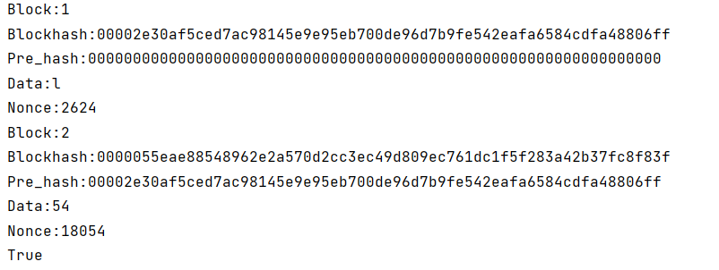

# 搭建简易区块链

曲解了project意思但是做都做了传上来

## 代码说明

依照区块链的定义简易搭建了一个具有部分功能的区块链，可以增删挖掘区块

## 运行指导

可以修改database

## 结果截图

## 引用参考

代码参考了Youtube视频https://www.youtube.com/watch?v=oPwAy2faOUI&list=PLtCKS3CuBDYV_Vyl1ZH2Je8gSdXfQf4e3&index=3