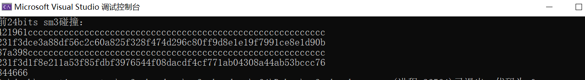

## Project: implement the Rho method of reduced SM3

#### 代码说明：

该代码基于Openssl的sm3实现进行，使用语言为C++，运行环境为visual studio 2022。

#### 代码运行方法：

1、将代码load到本地

2、用**vs2022**打开**sm3_rho_demo.sln**文件，并运行，如果出现无法识别Openssl库中的代码，则按照openssl配置方法中的内容进行配置。

#### 运行结果：

对sm3的前24bits的进行碰撞，耗时5s左右。

